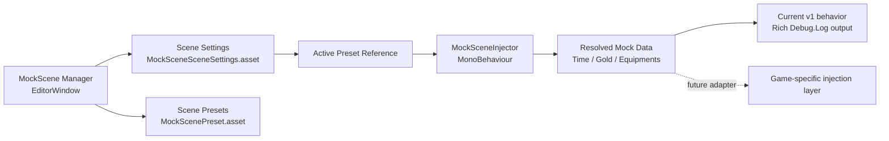

# MockScene

[](https://unity.com/)
[](./LocalPackages/org.tikim.mockscene/package.json)
[](./LICENSE)
[](#openupm-status)

[한국어 문서](./docs/README.ko.md) · [Package README](./LocalPackages/org.tikim.mockscene/README.md)

Scene-scoped mock scenario management for Unity 6.

MockScene brings a Spring Profile style workflow to Unity scenes: choose one preset as the active scenario before play mode, let the scene resolve it automatically, and keep test data isolated per scene instead of scattering manual setup steps across inspectors.

> [!IMPORTANT]
> Git installation is currently a 2-step process. `NaughtyAttributes` must be installed first because Unity cannot automatically resolve this dependency for Git-based transitive package installation from `package.json`.

## Why MockScene

| Capability | What it gives you |
| --- | --- |
| Scene-scoped presets | Each scene owns its own mock data and active scenario. |
| Editor-first workflow | Manage presets from `Tools > MockScene Manager`. |
| Play mode handoff | `MockSceneInjector` resolves the active preset on `Awake()`. |
| Team-friendly assets | Scene settings and presets live in versioned project assets. |
| Safe current-state logging | The runtime path currently logs resolved data before you wire it into game systems. |

## Quick Start

1. Install `NaughtyAttributes`.
2. Install `MockScene` from the Git URL in this repository.
3. Open your scene and save it.
4. Open `Tools > MockScene Manager`.
5. Create `Scene Settings`, create one or more presets, and choose one as active.
6. Add `MockSceneInjector` to a manager object in the scene.
7. Press `Play with Active Preset`.

## Installation

### Option A. Install from Git URL

Tag-based installation is recommended for reproducible builds.

#### In Unity

Open `Window > Package Manager > + > Add package from git URL...` and add these packages in order:

1. `https://github.com/dbrizov/NaughtyAttributes.git#upm`
2. `https://github.com/xhdtn8070/mock-scene.git?path=/LocalPackages/org.tikim.mockscene#v1.0.0`

If you are testing before a release tag exists, use the branch fallback:

`https://github.com/xhdtn8070/mock-scene.git?path=/LocalPackages/org.tikim.mockscene#main`

#### In `Packages/manifest.json`

```json
{
  "dependencies": {
    "com.dbrizov.naughtyattributes": "https://github.com/dbrizov/NaughtyAttributes.git#upm",
    "org.tikim.mockscene": "https://github.com/xhdtn8070/mock-scene.git?path=/LocalPackages/org.tikim.mockscene#v1.0.0"
  }
}
```

> [!TIP]
> Use `#main` only when you intentionally want the latest branch state. Prefer semver tags such as `#v1.0.0` for stable teams and CI environments.

### Option B. OpenUPM

The OpenUPM registration PR for MockScene was merged on April 16, 2026 (KST).
The package page and registry entry can take a little time to finish indexing after
the merge, so if `org.tikim.mockscene` is not visible yet, use the Git install
above and try OpenUPM again a bit later.

Once the registry entry is live, install it with:

```bash
openupm add org.tikim.mockscene
```

Or by adding the scoped registry manually:

```json
{
  "scopedRegistries": [
    {
      "name": "package.openupm.com",
      "url": "https://package.openupm.com",
      "scopes": [
        "org.tikim"
      ]
    }
  ],
  "dependencies": {
    "org.tikim.mockscene": "1.0.0"
  }
}
```

> [!NOTE]
> `NaughtyAttributes` is already available on OpenUPM, so the OpenUPM install path
> is the best long-term option once the package listing becomes visible.

## Scene-Based Workflow

MockScene stores scene-owned assets under:

```text
Assets/MockScene/Scenes/<SceneName>/
```

The expected authoring flow is:

1. Save the target scene.
2. Open `Tools > MockScene Manager`.
3. Create a `MockSceneSceneSettings` asset for the current scene.
4. Create one or more `MockScenePreset` assets for the same scene.
5. Mark one preset as active.
6. Attach `MockSceneInjector` to a scene object.
7. Enter play mode from the manager window.

You can also copy presets and optionally scene settings from another scene through the manager window.

## Architecture Overview



## Included Package Surface

| Type | Purpose |
| --- | --- |
| `MockScenePreset` | Defines mock values like time of day, optional gold override, and equipment list. |
| `MockSceneSceneSettings` | Tracks the owning scene, scene-local presets, and the active preset reference. |
| `MockSceneInjector` | Resolves the active preset on `Awake()` in editor play mode. |
| `MockScene Manager` | Editor window for scene-level preset management and scene-to-scene copying. |

## Current Status

MockScene is ready for editor-driven scene scenario management.

The runtime injector currently stops at a rich diagnostic log. That is intentional for v1. It gives you a safe, reviewable handoff point before wiring the resolved preset into your own save systems, economy services, or gameplay bootstrap logic.

### Current limitations

- Injection is editor-only by design.
- The active preset is stored in a scene-owned settings asset, not in a global profile.
- Git installation requires `NaughtyAttributes` first.
- OpenUPM availability can lag briefly behind the metadata merge while the registry and website finish indexing.

## OpenUPM Status

This repository is prepared for public package distribution:

- MIT license is included.
- The package metadata includes documentation, changelog, and license URLs.
- `CHANGELOG.md` is versioned with `1.0.0`.
- The recommended Git install format uses semver tags such as `v1.0.0`.
- The OpenUPM registration PR has already been merged: [openupm/openupm#6410](https://github.com/openupm/openupm/pull/6410).

OpenUPM links:

- Package page: [openupm.com/packages/org.tikim.mockscene](https://openupm.com/packages/org.tikim.mockscene/)
- Registry endpoint: [package.openupm.com/org.tikim.mockscene](https://package.openupm.com/org.tikim.mockscene)

If those URLs still return `404`, the package is usually just waiting for indexing.
For immediate use, the Git tag install remains the safest fallback.

## Roadmap

- Add a game-facing injection adapter interface so presets can feed live systems directly.
- Add sample assets and demo scenes.
- Add screenshot or GIF documentation for the editor window.
- Add richer validation rules and optional profile templates.

## Repository Layout

```text
mock-scene/
├── LocalPackages/
│   └── org.tikim.mockscene/
│       ├── Runtime/
│       ├── Editor/
│       ├── Tests/
│       ├── CHANGELOG.md
│       ├── README.md
│       └── package.json
├── docs/
│   └── README.ko.md
└── README.md
```
