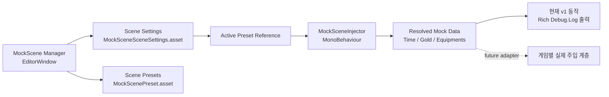

# MockScene

[English README](../README.md) · [패키지 README](../LocalPackages/org.tikim.mockscene/README.md)

Unity 6용 씬 단위 Mock 시나리오 관리 패키지입니다.

MockScene은 Java의 Spring Profile처럼, 플레이 전에 특정 씬에 어떤 가짜 데이터 세트를 주입할지 미리 선택할 수 있게 해줍니다. 씬마다 테스트 프리셋을 따로 관리하고, 에디터 창에서 Active 프리셋을 고른 뒤 바로 플레이 모드로 들어가는 흐름을 목표로 합니다.

> [!IMPORTANT]
> Git으로 설치할 때는 `NaughtyAttributes`를 먼저 설치해야 합니다. 현재 구조에서는 Git 기반 패키지의 전이 의존성을 Unity가 자동으로 함께 설치해주지 않기 때문입니다.

## MockScene이 해주는 일

| 기능 | 설명 |
| --- | --- |
| 씬별 프리셋 분리 | 씬마다 별도의 Mock 데이터 세트를 가질 수 있습니다. |
| 에디터 중심 관리 | `Tools > MockScene Manager`에서 프리셋 생성, 활성화, 복사를 처리합니다. |
| 플레이 모드 연결 | `MockSceneInjector`가 `Awake()`에서 현재 씬의 Active 프리셋을 읽습니다. |
| 팀 공유 자산 구조 | 설정과 프리셋을 프로젝트 자산으로 관리해서 Git으로 공유하기 좋습니다. |
| 안전한 1차 통합 | 현재 v1은 실제 게임 데이터 주입 전에 보기 좋은 로그로 결과를 확인합니다. |

## 빠른 시작

1. `NaughtyAttributes`를 설치합니다.
2. 이 저장소의 `MockScene` 패키지를 Git URL로 설치합니다.
3. 대상 씬을 저장합니다.
4. `Tools > MockScene Manager`를 엽니다.
5. `Scene Settings`와 프리셋을 생성한 뒤, 하나를 Active로 지정합니다.
6. 씬 오브젝트에 `MockSceneInjector`를 붙입니다.
7. `Play with Active Preset` 버튼으로 플레이합니다.

## 설치 방법

### 1. Git URL로 설치

재현 가능한 설치를 위해 태그 기반 설치를 권장합니다.

#### Unity UI에서 설치

`Window > Package Manager > + > Add package from git URL...` 메뉴에서 아래 순서대로 설치합니다.

1. `https://github.com/dbrizov/NaughtyAttributes.git#upm`
2. `https://github.com/xhdtn8070/mock-scene.git?path=/LocalPackages/org.tikim.mockscene#v1.0.0`

아직 릴리즈 태그가 없는 시점에는 아래 fallback을 사용할 수 있습니다.

`https://github.com/xhdtn8070/mock-scene.git?path=/LocalPackages/org.tikim.mockscene#main`

#### `Packages/manifest.json`에서 설치

```json
{
  "dependencies": {
    "com.dbrizov.naughtyattributes": "https://github.com/dbrizov/NaughtyAttributes.git#upm",
    "org.tikim.mockscene": "https://github.com/xhdtn8070/mock-scene.git?path=/LocalPackages/org.tikim.mockscene#v1.0.0"
  }
}
```

> [!TIP]
> 운영 프로젝트나 CI에서는 `#main`보다 `#v1.0.0` 같은 태그 고정을 추천합니다.

### 2. OpenUPM 방식

MockScene은 이제 OpenUPM에서 바로 설치할 수 있습니다.

- 패키지 페이지: [openupm.com/packages/org.tikim.mockscene](https://openupm.com/packages/org.tikim.mockscene/)
- 레지스트리 엔드포인트: [package.openupm.com/org.tikim.mockscene](https://package.openupm.com/org.tikim.mockscene)

설치는 아래처럼 하면 됩니다.

```bash
openupm add org.tikim.mockscene
```

또는 scoped registry를 직접 추가하는 방식도 사용할 수 있습니다.

```json
{
  "scopedRegistries": [
    {
      "name": "package.openupm.com",
      "url": "https://package.openupm.com",
      "scopes": [
        "org.tikim"
      ]
    }
  ],
  "dependencies": {
    "org.tikim.mockscene": "1.0.0"
  }
}
```

> [!NOTE]
> `NaughtyAttributes`는 이미 OpenUPM에 올라가 있으므로, 이제는 OpenUPM 설치 경로가 새 프로젝트 기준 가장 깔끔합니다.

## 씬 기준 사용 흐름

MockScene 자산은 아래 경로에 저장되도록 설계되어 있습니다.

```text
Assets/MockScene/Scenes/<SceneName>/
```

기본 사용 흐름은 다음과 같습니다.

1. 씬을 저장합니다.
2. `Tools > MockScene Manager`를 엽니다.
3. 현재 씬용 `MockSceneSceneSettings`를 생성합니다.
4. 현재 씬용 `MockScenePreset`을 하나 이상 생성합니다.
5. 사용할 프리셋을 Active로 지정합니다.
6. 씬 오브젝트에 `MockSceneInjector`를 추가합니다.
7. 에디터 창에서 플레이를 시작합니다.

필요하면 다른 씬의 프리셋이나 씬 설정을 현재 씬으로 복사할 수도 있습니다.

## 아키텍처 개요



## 포함된 주요 구성

| 타입 | 역할 |
| --- | --- |
| `MockScenePreset` | 시간대, 골드 override, 장비 목록 같은 Mock 값을 정의합니다. |
| `MockSceneSceneSettings` | 씬 소유 정보, 프리셋 목록, Active 프리셋을 관리합니다. |
| `MockSceneInjector` | 에디터 플레이 모드에서 Active 프리셋을 읽습니다. |
| `MockScene Manager` | 씬 단위 프리셋 관리와 복사 기능을 제공하는 에디터 창입니다. |

## 현재 상태와 제한 사항

MockScene은 현재 에디터 기반 씬 시나리오 관리까지 준비되어 있습니다.

다만 v1의 런타임 인젝터는 실제 게임 시스템에 값을 직접 주입하지 않고, 우선 사람이 검토하기 쉬운 로그를 출력합니다. 이 지점이 게임별 데이터 주입 코드와 연결할 자연스러운 확장 지점입니다.

### 현재 제한 사항

- 주입 동작은 의도적으로 에디터 전용입니다.
- Active 프리셋은 전역 프로필이 아니라 씬 소유 설정 자산에 저장됩니다.
- Git 설치 시 `NaughtyAttributes`를 먼저 넣어야 합니다.

## OpenUPM 상태

이 저장소는 공개 패키지 배포를 위한 기본 준비를 갖춘 상태입니다.

- MIT 라이선스 포함
- 문서, 체인지로그, 라이선스 URL 메타데이터 포함
- `1.0.0` 기준 `CHANGELOG.md` 포함
- 태그 기반 Git 설치 예시 제공
- OpenUPM 등록 PR 머지 완료: [openupm/openupm#6410](https://github.com/openupm/openupm/pull/6410)
- MockScene은 현재 OpenUPM에서 `org.tikim.mockscene`으로 설치 가능합니다.

## 로드맵

- 실제 게임 시스템에 연결할 주입 어댑터 계층 추가
- 샘플 프리셋과 데모 씬 추가
- 에디터 창 스크린샷 또는 GIF 문서 추가
- 프리셋 검증 규칙과 템플릿 기능 강화
